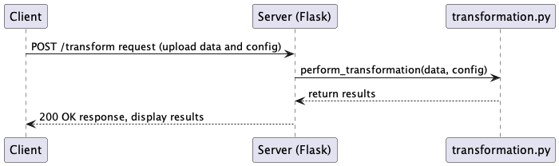

# crisp-take-home
## Overview
This take-home assessment is a web application developed in the Python programming language (3.11) using the Flask web framework as a development server. The client-side part of the web app is written in HTML and CSS scripting languages and Jinja templating language to format the layout of webpages. The server-side of the web app is composed of two REST API endpoints that receive client requests for access to a homepage and transformation of uploaded input data. Additionally, the server-side uses the Pandas (2.2.1) tool for transformation data wrangling and data manipulation. A simplified sequence diagram for a transformation request of the web app is included below.



## Compatibility
The crisp-app is built on Python 3.11.x

## Installing
Install with `pip` or your desired package manager.

```
python3.11 -m pip install crisp-app-1.0.0.tar.gz
```

Verify the installation was successful by showing the list of pip-installed packages.

```
pip list | grep crisp-app
```