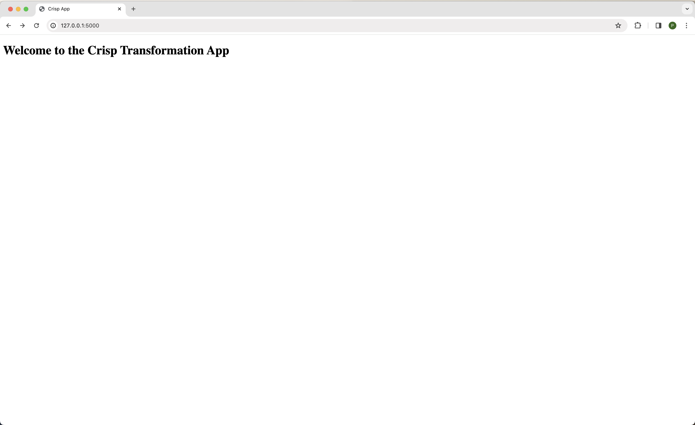
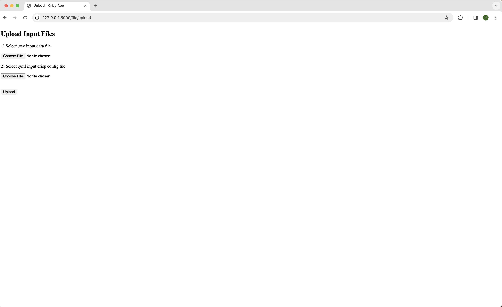
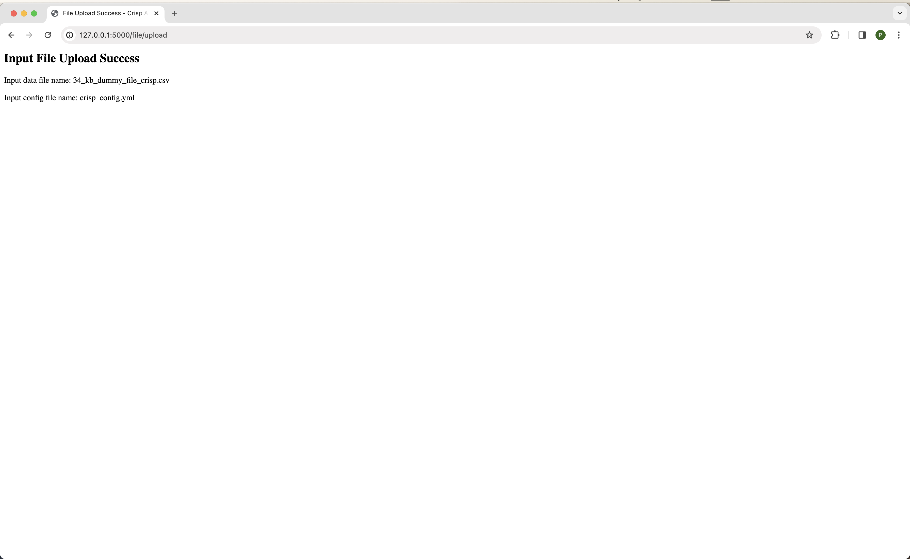
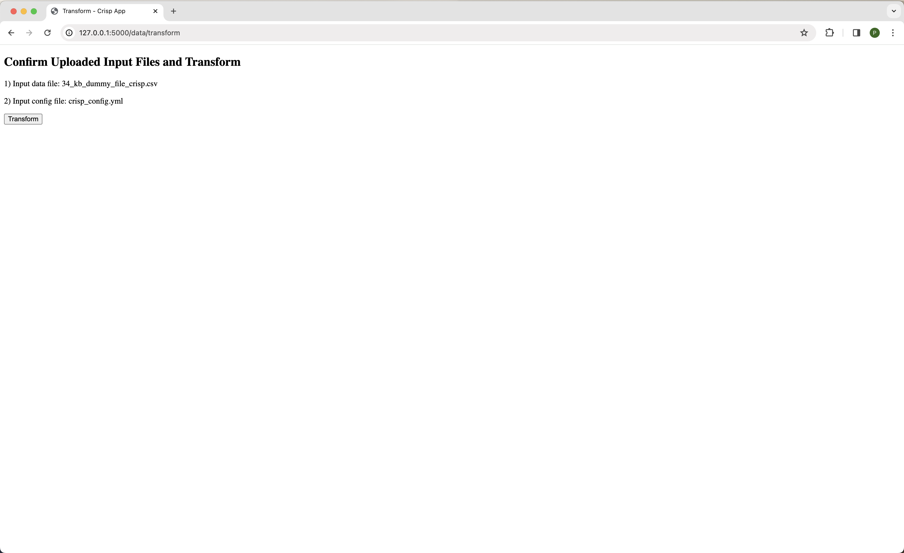
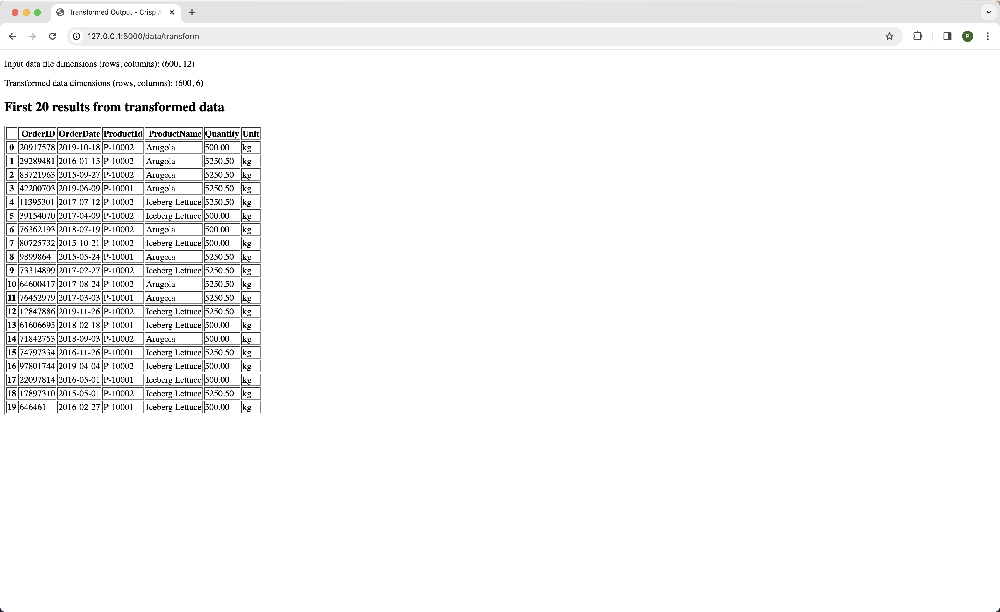

# crisp-take-home
## Overview
The crisp_app is a web application developed in the Python programming language (3.11) using the Flask web framework as a development server. The crisp_app is built using requirements outlined in a [Crisp take-home assessment](docs/crisp_take_home_assessment.pdf). The client-side part of the web app is written in HTML and CSS scripting languages and Jinja templating language to format the layout of webpages. The server-side of the web app is composed of three REST API endpoints that receive client requests in order to: 1) access a homepage, 2) upload input files, and 3) transform uploaded input data. Additionally, the server-side uses the Pandas (2.2.1) tool for transformation data wrangling and data manipulation. A simplified sequence diagram for typical crisp_app requests is included below.


## Compatibility
The crisp_app requires Python 3.11 or higher.

## Installing
### Extract Shared Submission File
Open a terminal window and extract the contents of the submission file named `crisp_app_peter_phyall.tar.gz` (found shared in the [Google Drive link](https://drive.google.com/drive/folders/1IkJ-MncAc1NvZixKRov4oqZU9xn9CxCv?usp=sharing)) in a desired location using the following command:

```
tar -xvf crisp_app_peter_phyall.tar.gz 
```

(This submission file is a compressed file containing the various test data files and config file needed as inputs to the crisp_app, along with a copy of this README.md and additional documentation.)

### Create Virtual Environment
Next, in the same terminal window, create a virtual environment using the following command:

```
python -m venv .<name-of-virtual-environment>
```

Activate the virtual environment using the following command:

```
source .<name-of-virtual-environment>/bin/activate
```

### Clone Git Repo
In the same terminal window, navigate to a desired location and clone the `main` branch of the [git repo](https://github.com/pdrogos02/crisp-take-home/tree/main) (public) using the following command:

```
git clone https://github.com/pdrogos02/crisp-take-home.git
```

### Install crisp_app
In the root file path of the cloned git repo, install the crisp_app into the virtual environment using the following command: 

```
python setup.py install
```

(The above command will also install all crisp_app dependencies.)

Verify the installation was successful using the following command:

```
pip list | grep crisp-app
```

The following output should appear:

```
crisp-app       1.0.1
```

## Tutorial
### Run crisp_app
In the root file path of the cloned repo, run the crisp_app using the following command:

```
export FLASK_ENV=development && \
flask --app crisp_app run
```

(Since the crisp_app is not meant to run in production, it is sufficient to set `FLASK_APP=development`)

To confirm the Flask server is running, the following message should appear:

```
 * Serving Flask app 'crisp_app'
 * Debug mode: on
WARNING: This is a development server. Do not use it in a production deployment. Use a production WSGI server instead.
 * Running on http://127.0.0.1:5000
Press CTRL+C to quit
```

Copy and paste the running crisp_app's URL `http://127.0.0.1:5000` into an Internet browser (e.g. Google Chrome). The following message should appear:



### Transform Data using crisp_app
#### Upload Input Files
To transform data, first upload two input files. To upload two input files, visit the following endpoint, `/file/upload`, via the URL [http://127.0.0.1:5000/file/upload](http://127.0.0.1:5000/file/upload). The following message should appear:



The two files needed for uploading are a .csv input file and a .yml/.yaml config file. Both file types can be found in the directory of the [extracted submission file](#extract-shared-submission-file). The crisp_app is not intended to transform data of other file types at this time.

Select the appropriate files (and file types) requested. Once complete, click `Upload`. The following message should appear:



The required input files are now uploaded and ready for transformation.

#### Transform Uploaded Data
To transform the uploaded input data, visit the following endpoint, `/data/transform`, via the URL [http://127.0.0.1:5000/data/transform](http://127.0.0.1:5000/data/transform). The following message should appear:



Confirm the two files previously uploaded and the click `Transform`.

Depending on how large the uploaded input data is, there may be a slight delay. Once transformation is complete, the following message should appear:



The input data and transformed data dimensions are displayed along with the first 20 transformed results.

The steps above to upload input files and transform data can be repeated for any of the provided input files found in the directory of the [extracted submission file](#extract-shared-submission-file).